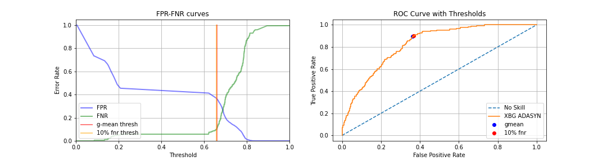
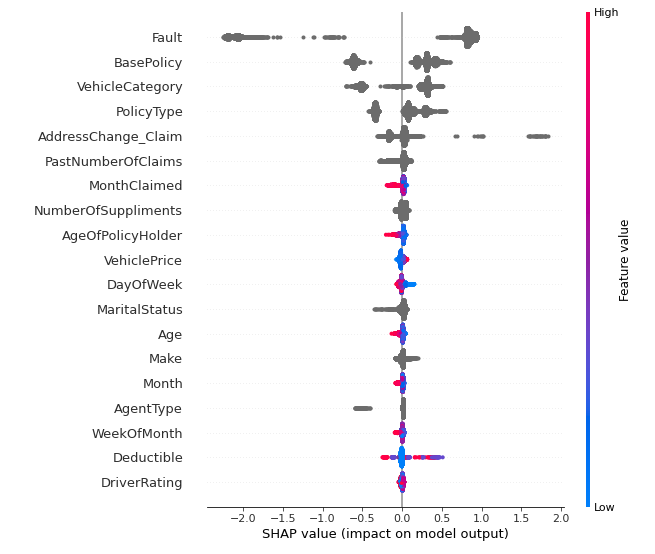
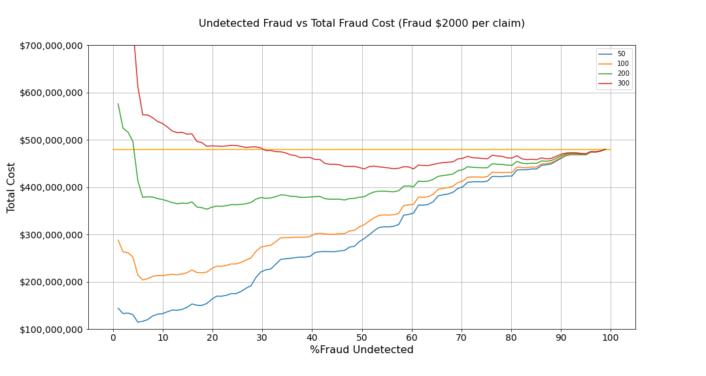

# Vehicle Insurance Fraud Detection with Gradient Boosting #

Morgan Didjurgis Flex 40 Weeks Instructor: Abhineet Kulkarni

## Business Problem ##

This project aims to build a model that can predict whether a vehicle insurance claim is fraud based on 30 different input features. Fraudulent claims are costly to both the company and the customer, as they can drive up premiums as the cost of doing business becomes higher. The ability to flag transactions as likely fraudulent allows for more targeted fraud detection. The challenge is to flag as many 'actual fraud' claims while not flagging too many non-fraudulent claims, since this increases the follow on work to investigate the claim.

## Data ##

The data for this project came from Kaggle __[(Kaggle Dataset Link)](https://www.kaggle.com/shivamb/vehicle-claim-fraud-detection)__ and originated with the company Oracle. It is somewhat old (from the 90s), but was one of the larger datasets available for insurance claim fraud detection.  While there may be additional claim data available today, all of these categories are still applicable and should still be expected to provide reasonable predictions in present day.

This data has a significant class imbalance. Only 6% of the claims listed are labeled as fraudulent. This can be addressed using class weighting in the model or oversampling. Undersampling would be difficult for this data since there are so few fraudulent claims. The three oversampling methods that I tried are RandomOverSample, SMOTE, and ADASYN. Ultimately, class weighting performed the best in the Gradient Boosting models. 

### Features ###

There are 30 features in the data set, but ultimately only 19 of them are used in the model. These include things like whether the claimant or third party was at fault, day of week and month of claim, policy type, age of policy holder, and cost of vehicle.  The data had man features that could be numerical but were grouped into ranges. Where possible I converted this back into numerical features. Categorical variables were one hot encoded for use with XGBoost whereas catboost handled the categorical variables when fitting the model.

## Model ##

Two different gradient boosting models were trained to the data: XGBoost and CatBoost. 

For XGBoost, class weighting, random over sampling, SMOTE, and ADASYN were all tested to deal with the class imbalance.  Early stopping rounds were used to avoid overfitting the model.

For CatBoost, class weighting was used to deal with the class imbalance. The model was fit with a training pool and eval pool so that the iteration with the best validation score for the eval metric (I used logloss and tried AUC) was kept to avoid overfitting.

For both XGBoost and CatBoost I used GridSearchCV to tune hyperparamaters.  I tested this using AUC, Recall, and f1 score as the eval metrics. Ultimately, I used AUC to find the best model.

After tuning hyperparameters for the models with all 30 features, I explored feature importances for the best model and tried the training it on data with less features, selected for their prediction value change. I found that the model with the 19 most important features by prediction value change performed slightly better than models with all 30 features after hyperparameter tuning.

### Criteria for Grading the Model ###

Because we are trying to balance identifying as much fraud as possible while not flagging too many non-fraudulent claims, we will rely heavily on the balance between the False Negative Rate (FNR) and the False Positive Rate (FPR) to determine if the model is performing well.  It is more important to identify fraud than have a higher accuracy, but this can't result in flagging everything.

Furthermore, if we relied on accuracy alone, just guessing 'not fraud' every time in such an imbalanced data set would result in a 94% accuracy score.

## Model Selection ##

Ultimately, a catboost model that uses 19 of the 30 features produces the best results, although the difference isn't significant. The test data (using a threshold meant to capture 90% of the fraud) was able to flag 87% of fraud while also flagging slightly less than 36% of the non-fraud as fraud.  These are not ideal outcomes, but depending on the cost of fraud vs. the cost of investigating claims that turn out not to be fraudulent, the threshold could be shifted to optimize the overall cost.

The selected model ran for 5000 iterations at a learning rate of .001. Class weighting was used and some l2 regularization.

Below are the FPR-FNR curve and ROC Curve for the selected model using the validation set. We can see that FNR rate increases rapidly to the right of the selected threshold, so it is difficult to move it any more to the right without missing too much fraud.

### Feature Importance ###

Shap values for the final model show similar feature importances as the best catboost model with all the features included.  Fault  has the most impact, followed by BasePolicy, VehicleCategory, PolicyType, and AddressChange_Claim.

## Example Cost Analysis ##

To give a rough idea of how a company could choose an acceptable FNR, 
we'll assume the following:

>-Company receives 4 million claims a year  (Allstate has ~16 million customers, assume 12 million have car insurance,  Americans file a claim once every three years on average) 

>-Fraudulent claims cost 2000 dollars on average 

>-Try various costs for the claim investigation process

This plot shows us that the usefulness of this model depends on the average cost of fraud and the cost to investigate claims.  If the cost to investigate is too high compared to the average cost of fraud, it may not save the company money to flag fraud.  Lower costs to investigate in relation to cost of fraud tend to have monetary benefit even if large percentages of actual fraud are missed. This would have to be evaluated carefully before implementation.

## Conclusions ##

The model produced in this project can identify approximately 90% of fraudulent claims while flagging only 36% of non-fraudulent claims as potential fraud.

The most important characteristics of a claim to this prediction are whether the claimant or a third-party is at fault, the base policy, vehicle category, policy type, and whether there was an address change.

### Next Steps ###

To optimize this model for use, it would be important to understand the cost of fraud vs. the cost to investigate a claim. This would help determine an acceptable level of fraud to miss in order to reduce the number of false positives.

The data for this project was also very general in the way it grouped values into ranges. More specific information on the claims could help improve the model. It would also be useful to examine more claim observations.

Lastly, some fraudulent claims are more expensive than others and these could have different characteristics. If the cost of the fraud was available it could be useful to group fraud labels into 'high-cost' and 'low-cost' fraud and focus on predicting fraud that is high-cost.  This could be achieved by conducting multiclass classification or by only trying to classify a claim as 'high-cost fraud' or 'not high cost fraud'. One could still examine if the low-cost fraud ends up getting frequently flagged by the model as a result of targeting high-cost fraud.

